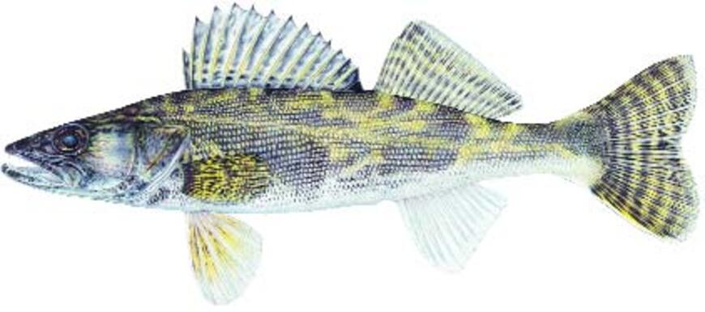

# Saugeye

Distribution: 
The first saugeye stocking in Oklahoma was in Lake Thunderbird during May 1985. Since this initial stocking many other state lakes have been stocked with saugeye, including Atoka Bluestem, Burtschi, Carl Blackwell, Ellsworth, Fort Cobb, Foss, Great Salt Plains, Hall, Holdenville, Jean Neustadt, Lawtonka, Pine Creek, Shawnee Lakes, Sooner, Tom Steed, Vanderwork, and Waurika.  
Oklahoma is fortunate to have these unique species of the perch family in many of its lakes.  To identify them, first look at the spiny dorsal fin.  The walleye will have no spots on this fin; the sauger will have distinct spots; and the hybrid of the two species, the saugeye, will have spots and bars in the webbing of its spiny dorsal fin.  The color of the fish and the presence or absence of the cheek scales may also help identify the difference.  The eyes of this species give off an eerie glow due to the tapetum lucidum, a reflective layer on the retina, This adaptation is for feeding at night in low light levels.
Walleye and saugeye are not native to the Sooner State. Like stripers and hybrids, they were introduced and created in hatcheries, respectively, to fill newly-created niches in reservoirs.
Walleye were first stocked in 1950 in lakes Tenkiller and Canton. Saugeye, which are produced by crossing walleye with native sauger, are a more recent addition to state waters. Both species are regarded as some of the best-eating fish in freshwater.

Habitat: 
Saugeye tend to congregate near the bottom on sand bars or near ledges and drop-offs.

Natural Food Sources: 
Saugeye eat fish, almost exclusively, from the time they are stocked.

Spawning: 
Saugeye are produced within our state fish hatcheries. Female walleye are crossed with male sauger resulting in a hybrid known as saugeye. Although not sterile, saugeye must be stocked routinely in order to maintain fishable populations.

Facts: 
Saugeye make first class table fare. They are being stocked particularly in lakes with stunted crappie because once they reach 16 inches, they begin to feed on these fish, thus improving the crappie fishery. Anglers can look forward to bigger and better saugeye fishing throughout the state.
In March and April, walleye move up onto rocky substrate to spawn. In many lakes, the preferred spawning habitat is rip-rap along dams and bridges. Jigs are excellent bait choices. Once spawning is complete, fish move to deeper water in main-lake areas. Trolling with deep-diving crankbaits along shoreline drop-offs is a good method for locating fish. Once one is caught, work the area thoroughly with crankbaits, jigs or jig-and-minnow combinations. Tailwater fishing also can be productive, especially during periods of heavy flow.

Other tips to keep in mind when walleye and saugeye fishing include:

• Avid walleye anglers should check out Lake Waurika. Using stick baits and jig and grub combinations along the rip-rap of the dam is very productive in late February and March. Walleye up to nine pounds have shown up in recent electrofishing surveys.

• Try fishing for walleye from the rip-rap at Lake Hefner during the months of March and November. These are the most productive times for walleye anglers in this lake.

• Legal-sized saugeye (>18”) are often caught during the winter at Lake Thunderbird. The best time is from dusk until about two hours after sunset. Try using a shallow-running minnow bait retrieved very slowly.

• Saugeye have rejuvenated fishing at lakes Ft. Cobb, Tom Steed, and Lawtonka - all historically prime walleye waters. Recent netting samples confirmed that saugeye numbers now rival peak walleye abundances in the “heydays” at each of these lakes.

• Anglers desiring to catch both striped bass and saugeye in the same lake should plan a visit to lakes Carl Blackwell and Sooner. Both lakes have abundant populations of both species and high percentages of large fish.

